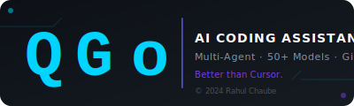

<div align="center">



# QGo — The Most Advanced AI Coding Assistant

**Created by [Rahul Chaube](https://github.com/Rahulchaube1)**

**More powerful than Cursor. Smarter than Aider. Multi-Agent AI that lives in your terminal.**

[](https://github.com/Rahulchaube1/QGo/actions/workflows/ci.yml)
[](https://www.python.org/)
[](LICENSE)
[](#-supported-models)
[](#-multi-agent-system)
[](#-copyright)

> *"The AI coding assistant that thinks like a team of senior engineers."*
> — Rahul Chaube

</div>

---

## ✨ Features

| Feature | Description |
|---------|-------------|
| 🤖 **Multi-LLM** | OpenAI, Anthropic Claude, DeepSeek, Gemini, Groq, Mistral, Ollama (local), and any litellm-supported model |
| 🗺️ **Repo Map** | Automatically maps your entire codebase so the AI understands structure and context |
| ✏️ **Smart Editing** | 4 editing formats: SEARCH/REPLACE blocks, whole-file, unified diffs, architect mode |
| 🏗️ **Architect Mode** | Two-pass: strong model plans → fast model implements |
| 👥 **Multi-Agent System** | 8 specialist agents (Planner, Coder, Reviewer, Tester, Debugger, DocWriter, Security, Refactor) work collaboratively |
| 🔀 **Git Integration** | Auto-commits, diffs, undo, branch management |
| 🎨 **Beautiful UI** | Rich terminal output with syntax highlighting, Markdown rendering, live streaming |
| 💬 **Interactive REPL** | Full-featured REPL with history, tab completion, multi-line input |
| 🌐 **Web Context** | Fetch any URL and add it as context (`/web https://...`) |
| 📎 **Clipboard** | Paste clipboard content into the conversation (`/paste`) |
| 🔍 **Auto Lint** | Automatically run your linter after each edit; ask AI to fix errors |
| 🧪 **Auto Test** | Run your test suite and fix failures automatically |
| 🔒 **Security Audit** | Dedicated security agent audits your code for vulnerabilities |
| ⚙️ **Configurable** | Project-level `.qgo.conf` + user-level `~/.qgo.conf` + env vars |
| 🔌 **Local Models** | Full Ollama support — run llama3, codellama, mistral, qwen locally |
| 📦 **100+ Languages** | Python, JS/TS, Go, Rust, Java, C/C++, Ruby, PHP, Swift, Kotlin, and more |

---

## 👥 Multi-Agent System

QGo's multi-agent system is what sets it apart. Instead of a single AI trying to do everything, QGo orchestrates a **team of 8 specialist agents** that collaborate like a real engineering team:

```
User Request
     │
     ▼
┌─────────────┐     Plans sub-tasks
│ 📋 PLANNER  │──────────────────────────────────────────────┐
└─────────────┘                                              │
                                                             ▼
┌─────────┐  ┌──────────┐  ┌────────┐  ┌──────────┐  ┌──────────┐
│⚙️ CODER │  │🔍 REVIEW │  │🧪 TEST │  │🐛 DEBUG  │  │🔒 SECURI-│
│         │  │          │  │        │  │          │  │   TY     │
└────┬────┘  └────┬─────┘  └───┬────┘  └────┬─────┘  └────┬─────┘
     │             │            │             │              │
     └─────────────┴────────────┴─────────────┴──────────────┘
                                     │
                              ┌──────▼──────┐
                              │ 📝 DOC +    │
                              │ ♻️ REFACTOR  │
                              └──────┬──────┘
                                     │
                              ┌──────▼──────┐
                              │  Final      │
                              │  Report     │
                              └─────────────┘
```

| Agent | Icon | Speciality |
|-------|------|-----------|
| **Planner** | 📋 | Decomposes tasks into ordered sub-tasks, assigns to specialists |
| **Coder** | ⚙️ | Writes clean, production-quality code with type hints |
| **Reviewer** | 🔍 | Reviews for correctness, performance, and best practices |
| **Tester** | 🧪 | Writes comprehensive pytest suites with edge cases |
| **Debugger** | 🐛 | Root-cause analysis and minimal bug fixes |
| **DocWriter** | 📝 | Google-style docstrings, README sections, inline comments |
| **Security** | 🔒 | Audits for injections, path traversal, exposed secrets, CVEs |
| **Refactor** | ♻️ | Improves structure (DRY, SRP, naming) without breaking behaviour |

### Multi-Agent Usage

```bash
# Run full multi-agent pipeline (auto-plans and executes)
qgo agent "add authentication to the Flask API"

# Run a specific agent directly
qgo agent --agent coder "implement pagination for list_users()"
qgo agent --agent security "audit auth.py for vulnerabilities"
qgo agent --agent tester "write tests for the payment module"

# Interactive: use /agent command in REPL
[QGo] > /agent add rate limiting to the API
```

---

## 🚀 Installation

```bash
pip install qgo
```

Or install from source for the latest features:

```bash
git clone https://github.com/Rahulchaube1/QGo
cd QGo
pip install -e .
```

---

## ⚡ Quick Start

```bash
# Interactive session (most common)
qgo

# One-shot command
qgo "add docstrings to all functions in utils.py"

# Add specific files to context
qgo --file main.py --file utils.py "refactor the error handling"

# Use a specific model
qgo --model claude-3-7-sonnet-20250219
qgo --model deepseek/deepseek-chat
qgo --model ollama/llama3.2 --api-base http://localhost:11434
```

---

## 🔑 Setting Your API Key

```bash
# OpenAI
export OPENAI_API_KEY=sk-...

# Anthropic
export ANTHROPIC_API_KEY=sk-ant-...

# DeepSeek
export DEEPSEEK_API_KEY=sk-...

# Google Gemini
export GEMINI_API_KEY=...

# Or pass directly
qgo --api-key sk-... --model gpt-4o
```

---

## 💻 Usage

### Interactive Mode

```
[QGo] > /add src/main.py src/utils.py
✓ Added: src/main.py
✓ Added: src/utils.py

[QGo] > add type hints to all functions

QGo is thinking...

# ... AI edits the files with SEARCH/REPLACE blocks ...
📦 Committed: a1b2c3d4  add type hints to all functions

[QGo] > /diff
# shows the diff...

[QGo] > /undo
✓ Undid last commit (changes kept in working tree)
```

### One-Shot Mode

```bash
# Fix a bug
qgo --file main.py "fix the null pointer exception in parse_config()"

# Add a feature
qgo --file api.py --file models.py "add pagination to the list_users endpoint"

# Write tests
qgo --file calculator.py "write comprehensive pytest tests for all functions"

# Explain code
qgo --file complex_algo.py "explain what this algorithm does"
```

### Architect Mode (for large tasks)

```bash
# Uses a strong model to plan, then a fast model to implement
qgo --edit-format architect "implement a REST API with authentication"
```

---

## 📝 Edit Formats

| Format | Flag | Best For |
|--------|------|----------|
| **editblock** | `--edit-format editblock` | Default. Most reliable. SEARCH/REPLACE blocks |
| **whole** | `--edit-format whole` | Small files. Complete file replacement |
| **udiff** | `--edit-format udiff` | When you need standard unified diffs |
| **architect** | `--edit-format architect` | Complex multi-file changes. Two-pass approach |

---

## 🤖 Supported Models

| Provider | Models |
|----------|--------|
| **OpenAI** | gpt-4o, gpt-4o-mini, gpt-4-turbo, o1, o1-mini, o3-mini |
| **Anthropic** | claude-3-7-sonnet, claude-3-5-sonnet, claude-3-opus, claude-3-haiku |
| **DeepSeek** | deepseek-chat, deepseek-coder, deepseek-r1 |
| **Google** | gemini-1.5-pro, gemini-1.5-flash, gemini-2.0-flash |
| **Groq** | llama3-8b, llama3-70b, mixtral-8x7b (ultra-fast) |
| **Mistral** | mistral-large, codestral |
| **Cohere** | command-r, command-r-plus |
| **Ollama** | llama3.2, codellama, mistral, qwen2.5-coder, deepseek-coder-v2 (local) |

```bash
# List all models
qgo models

# List by provider
qgo models --provider anthropic
```

---

## 🎮 REPL Commands

| Command | Description |
|---------|-------------|
| `/add <files>` | Add files to context (supports globs: `/add src/*.py`) |
| `/drop <files>` | Remove files from context |
| `/files` | List files currently in context |
| `/diff` | Show uncommitted git diff |
| `/commit [msg]` | Manually commit changes |
| `/undo` | Undo last git commit (keeps changes) |
| `/clear` | Clear conversation history |
| `/model <name>` | Switch to a different model |
| `/models` | List all available models |
| `/tokens` | Show token usage estimate |
| `/map` | Show repository map |
| `/run <cmd>` | Run a shell command, add output to context |
| `/web <url>` | Fetch a URL and add content to context |
| `/git <cmd>` | Run any git command |
| `/paste` | Paste clipboard content into conversation |
| `/ls [path]` | List directory contents |
| `/config` | Show current configuration |
| `/help` | Show help |
| `/exit` | Exit QGo |

---

## ⚙️ Configuration

QGo reads configuration from (highest priority first):
1. CLI flags
2. Environment variables (`QGO_*`)
3. Project-level `.qgo.conf`
4. User-level `~/.qgo.conf`

### `.qgo.conf` Example

```yaml
model: claude-3-7-sonnet-20250219
edit_format: editblock
auto_commits: true
show_diffs: true
map_tokens: 2048
auto_lint: true
lint_cmd: ruff check
auto_test: false
test_cmd: pytest
stream: true
```

### Environment Variables

| Variable | Description |
|----------|-------------|
| `QGO_MODEL` | Default model |
| `QGO_API_KEY` | API key |
| `QGO_API_BASE` | Custom API base URL |
| `QGO_EDIT_FORMAT` | Edit format |
| `QGO_AUTO_COMMITS` | Enable/disable auto-commits |
| `QGO_MAP_TOKENS` | Max tokens for repo map |
| `QGO_AUTO_LINT` | Enable auto-linting |
| `QGO_LINT_CMD` | Linter command |
| `QGO_AUTO_TEST` | Enable auto-testing |
| `QGO_TEST_CMD` | Test command |

---

## 🏗️ Architecture

```
qgo/
├── agents/                 # Multi-agent orchestration system
│   ├── orchestrator.py     # Coordinates all agents (AgentOrchestrator)
│   ├── base_agent.py       # Abstract BaseAgent, AgentMessage, AgentResult
│   └── specialist_agents.py # Planner, Coder, Reviewer, Tester, Debugger, DocWriter, Security, Refactor
├── llm/                    # Universal LLM backends
│   ├── litellm_provider.py # 100+ models via litellm
│   ├── model_info.py       # Model metadata & costs
│   └── streaming.py        # Streaming response handling
├── coders/                 # Code editing engines
│   ├── base_coder.py       # Core chat+edit loop
│   ├── editblock_coder.py  # SEARCH/REPLACE (default)
│   ├── whole_coder.py      # Full file replacement
│   ├── udiff_coder.py      # Unified diff
│   └── architect_coder.py  # Two-pass plan+implement
├── repo/                   # Repository understanding
│   ├── repo_map.py         # Codebase symbol mapping
│   ├── git_repo.py         # Git operations
│   └── file_watcher.py     # Live file watching
├── ui/                     # Terminal user interface
│   ├── terminal.py         # Rich-based I/O
│   ├── repl.py             # Interactive REPL
│   └── commands.py         # Slash-command handler
├── utils/                  # Utilities
│   ├── file_utils.py       # File operations + diffs
│   ├── token_counter.py    # tiktoken-based counting
│   └── web_scraper.py      # URL fetching
├── config.py               # Configuration management
├── models.py               # Data types
└── main.py                 # CLI entry point
```

---

## 🔧 Development

```bash
# Clone and install dev dependencies
git clone https://github.com/Rahulchaube1/QGo
cd QGo
pip install -e ".[dev]"

# Run tests
pytest tests/ -v

# Lint
ruff check qgo/

# Format
black qgo/ tests/
```

---

## 🤝 Contributing

Contributions are welcome! Please:
1. Fork the repository
2. Create a feature branch
3. Add tests for new features
4. Run `ruff check` and `pytest` before submitting
5. Open a pull request

---

## 📄 License

Apache 2.0 — see [LICENSE](LICENSE) for details.

---

## © Copyright

**QGo** is created and maintained by **Rahul Chaube**.

```
Copyright (c) 2024 Rahul Chaube. All Rights Reserved.

Licensed under the Apache License, Version 2.0.
You may obtain a copy of the License at:
    http://www.apache.org/licenses/LICENSE-2.0

Author:  Rahul Chaube
GitHub:  https://github.com/Rahulchaube1
Project: https://github.com/Rahulchaube1/QGo
```

All source files, documentation, assets, and configuration in this repository are the intellectual property of **Rahul Chaube**. The QGo name, logo, and branding are owned by Rahul Chaube.

---

<div align="center">


<br/>

**QGo — The AI coding assistant built by Rahul Chaube.**

*© 2024 Rahul Chaube. All Rights Reserved.*
</div>